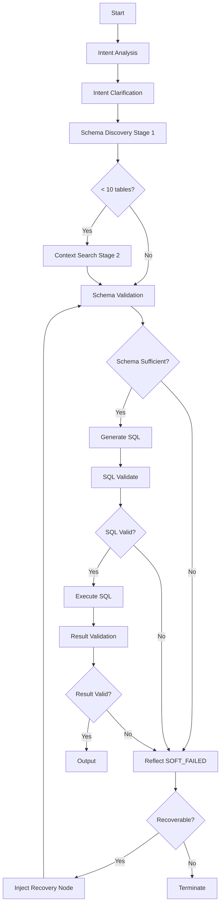

# Datus Text2SQL 任务处理流程介绍

> **文档版本**: v2.12
> **更新日期**: 2026-01-28
> **相关模块**: `datus/agent/workflow.yml`, `datus/agent/node/`

---

基于最新的系统优化与实战验证（2026-01-26），Text2SQL 任务处理流程已升级为**具备高度自愈能力的智能工作流**。系统采用了证据驱动的生成架构，引入了**Preflight 预检编排**、**意图澄清节点**、**专用 SQL 验证节点**、**数仓开发版 SQL 报告**、**多层级 Schema 发现**、**Schema 充分性验证**与**动态反思纠错**机制，确保在生成 SQL 之前先完成意图分析、Schema 探查和验证，然后进行 SQL 生成和验证，若不合适则通过 Reflect 进行反思，继续尝试，直到找不到满足的表才报错终止。

**v2.12 新增特性**（2026-01-28）：

- ✅ **外部知识增强（指标知识增强）**：在 Schema Discovery 阶段支持从 `ext_knowledge` 表检索指标/指标定义
- ✅ **新增配置参数**：`external_knowledge_enabled` 和 `external_knowledge_top_n` 用于控制外部知识检索
- ✅ **业务术语覆盖提升**：关键术语覆盖率从 1/5 提升至 5/5
- ✅ **Schema 自动检测与重建**：支持 `ext_knowledge` 表的 Schema 不匹配自动检测和表重建

**v2.11 新增特性**（2026-01-26）：

- ✅ **SQL 审查任务说明**：新增第 8 章，补充 SQL 审查任务的处理流程说明
- ✅ **工作流对比**：添加 Text2SQL 与 SQL 审查工作流的详细对比表
- ✅ **交叉引用**：添加到 SQL 审查文档的链接，方便用户查阅完整实现

**v2.10 新增特性**（2026-01-23）：

- ✅ **Preflight Orchestrator**：预检工具编排器，协调4个必需工具执行
- ✅ **硬失败机制**：无 Schema 时直接终止，不进入反思环节
- ✅ **多数据库支持**：Schema 发现支持扫描多个数据库
- ✅ **LLM Schema 匹配**：大规模数据集使用 LLM 进行表匹配
- ✅ **渐进式匹配**：根据反思轮次动态调整匹配策略

**v2.8 特性回顾**（2026-01-16）：

- ✅ **意图澄清节点** (`IntentClarificationNode`)：修复错别字、澄清模糊表述、提取业务实体
- ✅ **专用 SQL 验证节点** (`SQLValidateNode`)：集中式 SQL 语法和语义验证
- ✅ **工作流终止机制**：支持主动终止工作流，避免后台继续运行
- ✅ **相似度阈值过滤**：语义搜索增加 0.5 相似度阈值，过滤弱匹配结果
- ✅ **Context Search 优化**：触发阈值从 3 提升到 10，更频繁触发深度元数据扫描
- ✅ **批量 Schema 查询**：新增 `get_table_schemas()` 方法支持批量表结构查询
- ✅ **元数据自动修复**：`update_table_schema()` 方法支持 DDL 回填和元数据修复
- ✅ **多层缓存机制**：L1 缓存（嵌入模型）、LLM 缓存（1小时 TTL）、CLI 缓存（LRU 128）

## 1. 接口概览

**接口路径**: `POST /workflows/chat_research`
**功能**: 执行聊天研究工作流，支持 Text2SQL、SQL审查、数据分析等多种场景
**响应格式**: Server-Sent Events (SSE) 流式响应

## 2. 核心工作流架构

当前的 Text2SQL 任务默认采用 `text2sql` 工作流配置，这是一个包含**意图澄清**、**SQL 验证**与**反思（Reflection）**环节的闭环流程。

**工作流定义** (`datus/agent/workflow.yml`):

```yaml
text2sql:
  - intent_analysis       # 意图分析（任务类型识别）
  - intent_clarification  # 意图澄清（错别字、歧义、实体提取）⭐ NEW
  - schema_discovery      # Schema 发现（三阶段混合召回）
  - schema_validation     # Schema 充分性验证
  - generate_sql          # SQL 生成
  - sql_validate          # SQL 语法和语义验证 ⭐ NEW
  - execute_sql           # SQL 执行
  - result_validation     # 结果质量验证
  - reflect               # 反思与纠错（核心自愈组件）
  - output                # 结果输出
```

**设计理念**:

- **两阶段意图处理**：任务类型识别 → 业务意图澄清
- **三阶段 Schema 发现**：语义/关键词/LLM → Context 深度搜索 → Fallback 全表扫描
- **Preflight 预检编排**：生成前预执行4个必需工具，确保证据充分
- **双重验证机制**：Schema 充分性验证 → SQL 语法语义验证
- **智能反思机制**：软失败状态 + 动态策略注入，支持自愈恢复

## 3. 关键节点与执行逻辑

### 3.1 Intent Analysis (意图分析)

**目标**：识别任务类型（text2sql vs sql_review vs data_analysis）。

**执行逻辑**:

- 快速启发式检测：基于 SQL 关键词和模式识别任务类型
- 可选 LLM 分类：当启发式置信度 < 0.7 时，使用 LLM 分类
- 跳过逻辑：当 `execution_mode` 已指定时跳过此节点

### 3.2 Intent Clarification (意图澄清) ⭐ NEW v2.8

**目标**：理清用户的真实分析意图，处理表述不清、错别字等问题。

**核心能力**:

- **错别字修复**：`"华山"` → `"华南"`
- **歧义澄清**：`"最近的销售"` → `"最近30天的销售数据"`
- **实体提取**：`business_terms`、`time_range`、`dimensions`、`metrics`
- **查询规范化**：为 Schema Discovery 提供更清晰的搜索关键词

**实现方式**:

- 基于 LLM 的语义理解和修正
- 输出结构化 JSON 结果存储在 `workflow.metadata["clarified_task"]`
- 1 小时 TTL 缓存，避免重复调用

**示例**:

```python
# 原始任务
task = "帮我查下华山地区的销售数据"

# 澄清后
clarified_task = "帮我查询华南地区（广东）的销售数据"

# 提取的实体
business_terms = ["华南", "广东"]
time_range = "最近30天"（如有）
```

### 3.3 Schema Discovery (智能模式发现)

**目标**：解决"零召回"与"幻觉"问题，确保下游节点拥有真实的上下文。

**三阶段混合搜索策略**:

#### **阶段 1: 快速混合召回**

- **语义检索**：`SchemaWithValueRAG.search_similar()`，`top_n=20`，相似度阈值 0.5
- **混合检索**：向量 + FTS 融合排序，可选 LanceDB rerank（hybrid query + rerank）。当 `hybrid_rerank_enabled=true` 且候选表数量 ≥ `hybrid_rerank_min_tables`、模型文件存在且资源充足时触发；若模型缺失/资源不足或 reranker 初始化失败则跳过并回退到语义/FTS融合排序。
- **关键词匹配**：基于硬编码的业务术语映射
- **LLM 推断**：中文查询或模糊术语时触发，1 小时 TTL 缓存

**混合检索配置示例**（`agent.yml`）：
```yaml
schema_discovery:
  hybrid_search_enabled: true
  hybrid_use_fts: true
  hybrid_vector_weight: 0.6
  hybrid_fts_weight: 0.3
  hybrid_row_count_weight: 0.2
  hybrid_tag_bonus: 0.1
  hybrid_comment_bonus: 0.05
  hybrid_rerank_enabled: false
  hybrid_rerank_model: "./models/bge-reranker-large"
  hybrid_rerank_column: "definition"
  hybrid_rerank_min_cpu_count: 4
  hybrid_rerank_min_memory_gb: 8.0
```

**权重校验规则**:
- `hybrid_*_weight`、`hybrid_tag_bonus`、`hybrid_comment_bonus` 必须在 `[0,1]`，否则回退默认值并记录 warning
- `hybrid_rerank_min_tables` 必须 `>= 0`，否则回退为 20
- `hybrid_rerank_top_n` 必须 `>= 1`，否则回退为 50
- `hybrid_rerank_model` / `hybrid_rerank_column` 用于配置 reranker 模型与输入列（`hybrid_rerank_model` 需为本地模型路径）
- `hybrid_rerank_min_cpu_count` / `hybrid_rerank_min_memory_gb` 用于资源门槛校验，不满足则禁用 rerank

**统计字段说明**（写入 `workflow.metadata["schema_discovery_stats"]`）:
- `semantic_vector_hits`：向量召回数量
- `semantic_fts_hits`：FTS 召回数量
- `semantic_rerank_hits`：rerank 参与表数量
- `hybrid_*`：混合检索开关与权重配置快照（用于排查）

**量大场景推荐组合（Text2SQL）**:

1) SQL 生成（高并发 + 覆盖优先）
```yaml
schema_discovery:
  hybrid_search_enabled: true
  hybrid_use_fts: true
  hybrid_vector_weight: 0.5
  hybrid_fts_weight: 0.4
  hybrid_row_count_weight: 0.2
  hybrid_tag_bonus: 0.1
  hybrid_comment_bonus: 0.05
  hybrid_rerank_enabled: false
  # 启用外部知识增强（指标检索）
  external_knowledge_enabled: true
  external_knowledge_top_n: 5
```

2) SQL 审查（高精度 + 误报控制）
```yaml
schema_discovery:
  hybrid_search_enabled: true
  hybrid_use_fts: true
  hybrid_vector_weight: 0.6
  hybrid_fts_weight: 0.3
  hybrid_row_count_weight: 0.2
  hybrid_tag_bonus: 0.1
  hybrid_comment_bonus: 0.05
  hybrid_rerank_enabled: true
  hybrid_rerank_weight: 0.2
  hybrid_rerank_min_tables: 10
  hybrid_rerank_top_n: 50
  hybrid_rerank_model: "./models/bge-reranker-large"
  hybrid_rerank_column: "definition"
  hybrid_rerank_min_cpu_count: 4
  hybrid_rerank_min_memory_gb: 8.0
  # 启用外部知识增强（指标检索）
  external_knowledge_enabled: true
  external_knowledge_top_n: 5
```

#### **阶段 2: 深度元数据扫描** (Context Search)

**触发条件**：阶段 1 召回表数量 < 10

**执行内容**:

- **指标搜索**：在 `ContextSearchTools` 中搜索业务指标
- **参考 SQL 搜索**：查找历史相似查询的 SQL 模式
- **线程安全更新**：使用 `safe_context_update()` 防止竞态条件

#### **阶段 3: Fallback 全表扫描**

**触发条件**：前两阶段未找到任何候选表

**执行流程**:

1. 调用 `_fallback_get_all_tables()` 从数据库获取全部表名
2. 限制返回数量（最多 50 张表）避免上下文溢出
3. 使用候选表进行后续处理
4. **增强回退策略**：当 DDL 检索失败时，存储表名供 LLM 参考

#### **阶段 4: 外部知识增强** ⭐ NEW v2.12

**触发条件**：`external_knowledge_enabled: true` 时启用

**执行内容**:

- **指标知识检索**：在 `ext_knowledge` 表中搜索与查询相关的业务指标定义
- **搜索方法**：调用 `ContextSearchTools.search_external_knowledge()` 方法进行语义检索
- **结果注入**：检索到的知识通过 `workflow.task.external_knowledge` 注入到 Prompt 中
- **Top N 控制**：通过 `external_knowledge_top_n` 配置控制返回的知识条目数量（默认 5 条）

**知识注入流程**:

```python
# 1. Schema Discovery 阶段检索外部知识
external_knowledge = await ContextSearchTools.search_external_knowledge(
    query=clarified_task,
    top_n=config.external_knowledge_top_n
)

# 2. 注入到 workflow.task
workflow.task.external_knowledge = external_knowledge

# 3. 在 Generate SQL 阶段通过 Prompt 模板使用
# 参考下文 3.5 节
```

**配置示例**:
```yaml
schema_discovery:
  # ... 现有配置 ...
  # 启用外部知识增强（指标检索）
  external_knowledge_enabled: true
  external_knowledge_top_n: 5
```

### 3.4 Schema Validation (Schema 充分性验证)

**目标**：在 SQL 生成之前验证发现的 Schema 是否充分。

**验证维度**:

1. **最小要求检查**：至少有一张表被成功发现
2. **完整性检查**：所有发现的表都有完整的 DDL 定义
3. **查询-Schema 对齐度**：检查查询关键词与 Schema 的覆盖度

**动态阈值策略**:

- **简单查询** (≤3 术语): 50% 覆盖度要求
- **中等查询** (4-6 术语): 30% 覆盖度要求
- **复杂查询** (>6 术语): 20% 覆盖度要求

**硬失败机制** ⭐ NEW v2.10：

- 当 `table_schemas` 为空（无任何 Schema 发现）时，触发硬失败
- 使用 `ActionStatus.FAILED`（而非 SOFT_FAILED）
- 设置 `allow_reflection=False`（不允许反思）
- 生成详细诊断报告，包含根因分析和修复命令
- 直接终止工作流，避免无效的 SQL 生成

**软失败机制**：

- 覆盖度不足时使用 `ActionStatus.SOFT_FAILED`
- 设置 `allow_reflection=True` 确保继续到 reflect 节点进行自愈

### 3.5 Generate SQL (SQL 生成)

**目标**：基于已验证的 Schema 生成准确的 SQL 查询。

**关键特性**:

- 完全依赖 `schema_discovery` 加载并通过 `schema_validation` 验证的 Schema
- 使用结构化提示词模板（`sql_system_1.0.j2`）
- 支持外部知识（`ext_knowledge`）的优先级注入

**外部知识使用** ⭐ NEW v2.12:

当 `external_knowledge_enabled: true` 时，从 `ext_knowledge` 表检索到的知识（`knowledge_content`）会被注入到 Prompt 模板中，帮助 LLM 理解业务指标的定义和计算方式，从而生成更准确的 SQL。知识内容通过 `workflow.task.external_knowledge` 传递给 Prompt 渲染上下文。

### 3.6 SQL Validate (SQL 验证) ⭐ NEW v2.8

**目标**：对生成的 SQL 进行集中式验证，在执行前发现问题。

**验证维度**:

1. **SQL 语法验证**：通过 `sqlglot` 进行语法解析
2. **SQL 模式验证**：
   - 无引号的 LIKE 模式
   - 无引号的日期字面量
   - 需要引号的中文文本
   - 缺失的逗号
3. **表/列存在性验证**：通过 Schema metadata 验证表和列是否存在
4. **危险操作检查**：
   - DELETE 语句缺少 WHERE 子句
   - UPDATE 语句缺少 WHERE 子句
   - DROP TABLE 检测
   - TRUNCATE 检测

**验证失败处理**:

- 设置 `termination_status = SKIP_TO_REFLECT`
- 跳过执行，直接进入 reflect 节点进行修复

**专用输入类** (`SQLValidateInput`):

```python
class SQLValidateInput(BaseInput):
    sql_query: str  # 待验证的 SQL
    dialect: Optional[str]  # 数据库方言
    check_table_existence: bool = True  # 检查表存在性
    check_column_existence: bool = True  # 检查列存在性
    check_dangerous_operations: bool = True  # 检查危险操作
```

### 3.7 Execute SQL (SQL 执行)

**目标**：在目标数据库中执行生成的 SQL 查询。

**执行特性**:

- 支持多种数据库类型（Snowflake, SQLite, DuckDB, StarRocks）
- 可配置的超时机制（默认 60 秒）
- 详细的错误日志记录

### 3.8 Result Validation (结果质量验证)

**目标**：验证 SQL 执行结果是否符合预期。

**验证维度**:

1. **执行状态**：SQL 是否成功执行
2. **结果类型**：区分 DDL/DML 查询与 SELECT 查询
3. **结果质量**：检查结果集的合理性

### 3.9 Reflect (动态反思与纠错)

**目标**：赋予系统在执行失败后的自我修复能力。

**策略映射**:

- **SCHEMA_LINKING**：表缺失 → 插入 SchemaLinkingNode → SchemaValidationNode → GenerateSQLNode
- **DOC_SEARCH**：文档搜索缺失 → 插入 DocSearchNode
- **SIMPLE_REGENERATE**：SQL 逻辑错误 → 重新执行
- **REASONING**：需要深度探索 → 插入 ReasoningNode

**工作流终止机制** ⭐ NEW v2.8:

- 支持 `WorkflowTerminationStatus.TERMINATE_WITH_ERROR` 主动终止
- 支持 `WorkflowTerminationStatus.SKIP_TO_REFLECT` 跳过执行进入反思
- 确保 `workflow_task.cancel()` 防止后台继续运行

### 3.10 Output (结果输出)

**目标**：将最终结果返回给用户。

**输出格式**:

- 支持 CSV、JSON、Arrow 等多种格式
- 可选的文件保存功能
- SSE 流式返回

**数仓开发版 SQL 生成报告** ⭐ NEW v2.9

针对数据仓库开发者的二次审查需求，输出节点生成包含以下 6 部分的综合报告：

#### 第1部分：SQL 设计概述

- **任务理解**：展示澄清后的业务需求
- **设计思路**：SQL 设计的核心逻辑（CTE、JOIN、聚合等）
- **数据规模**：涉及的表数量和字段数量
- **验证状态**：语法、表存在性、列存在性验证摘要

#### 第2部分：使用的表和字段详情

以表格形式展示从 DDL 提取的元数据：

- **表清单**：表名、表备注、表类型、数据库、是否使用
- **字段清单**：表名、字段名、字段注释、用途（关联键/筛选条件/输出字段）
- **表关联关系**：展示 JOIN 关系和关联键

示例格式：
```markdown
**表清单** (1张表):
| 表名 | 表备注 | 表类型 | 数据库 | 是否使用 |
|------|--------|--------|--------|----------|
| dwd_assign_dlr_clue_fact_di | 线索事实表 | Fact Table | test | ✅ |

**字段清单** (5个字段):
| 表名 | 字段名 | 字段注释 | 用途 |
|------|--------|----------|------|
| dwd_assign_dlr_clue_fact_di | customer_id | 客户ID | 关联键 |
| dwd_assign_dlr_clue_fact_di | clue_type | 线索类型 | 筛选条件 |

**表关联关系**:
- table_a ← customer_id → table_b (INNER JOIN)
```

#### 第3部分：带注释的 SQL

为 SQL 添加业务逻辑注释，帮助开发者理解设计意图：

- **CTE 注释**：每个 CTE 前添加说明（如：`-- CTE: first_events - 识别首次事件`）
- **字段注释**：关键字段添加业务含义（如：`customer_id -- 客户ID`）
- **条件注释**：WHERE/JOIN 条件添加业务说明

示例：
```sql
-- SQL设计目的: 查询首次试驾后下定客户
-- 使用公共表表达式(CTE)组织复杂查询逻辑
-- CTE: first_test_drive - 识别首次试驾事件
WITH first_test_drive AS (
    SELECT customer_id, -- 客户ID
           MIN(event_date) as first_drive_date
    FROM dwd_assign_dlr_clue_fact_di
    WHERE clue_type = '首次试驾' -- 筛选线索类型
    GROUP BY customer_id
)
...
```

#### 第4部分：SQL 验证结果

使用表格形式清晰展示验证状态：

```markdown
| 验证项 | 状态 | 说明 |
|--------|------|------|
| 语法验证 | ✅ 通过 | SQL语法正确，符合SQL方言规范 |
| 表存在性 | ✅ 通过 | 所有表都在Schema中存在 |
| 列存在性 | ✅ 通过 | 所有列都在对应表中存在 |
| 危险操作 | ✅ 无危险操作 | 未检测到DELETE/DROP/TRUNCATE等操作 |
```

#### 第5部分：执行验证结果

**关键澄清**：明确区分 0 行数据与 SQL 错误

```markdown
**执行状态**: ✅ SQL已成功执行验证

**执行详情**:
- **语法正确**: ✅ SQL语法验证通过，数据库成功解析
- **执行返回**: 0行数据

**数据情况说明**:
当前数据库中没有匹配查询条件的数据。这表明:
- SQL逻辑正确（无语法错误，成功执行）
- 数据库中暂无满足条件的数据

**后续验证建议**:
如需验证SQL逻辑，可以:
1. 检查表数据是否存在（如：SELECT COUNT(*) FROM table_name）
2. 确认筛选条件的时间范围或枚举值是否合理
3. 检查数据是否已加载到指定时间段

**SQL适合生产使用**: ✅ 是
```

#### 第6部分：优化建议

基于 SQL 结构分析提供可操作的建议：

- **性能优化**：CTE 使用、索引建议、SELECT * 警告
- **数据质量建议**：时间范围检查、数据枚举值验证
- **后续分析建议**：添加筛选条件、扩展分析维度

**技术实现**：

- **14 个辅助方法**：在 `datus/api/event_converter.py` 中实现
- **DDL 解析**：复用 `parse_metadata_from_ddl()` 工具
- **SQL 结构分析**：使用 `sqlglot` 库解析 SQL
- **数据流**：`OutputNode` → `workflow.metadata["table_schemas"]` → `EventConverter`

**辅助方法列表**（共 14 个）：

| 方法 | 功能 |
|------|------|
| `_parse_ddl_comments()` | 从 DDL 提取表和列注释 |
| `_extract_table_info()` | 提取表和字段信息 |
| `_analyze_relationships()` | 分析表关联关系 |
| `_infer_field_usage()` | 推断字段用途（关联键/筛选/输出） |
| `_parse_sql_structure()` | 使用 sqlglot 解析 SQL 结构 |
| `_infer_cte_purpose()` | 推断 CTE 的业务目的 |
| `_get_field_comment()` | 从 Schema 获取字段注释 |
| `_add_field_comment()` | 为字段添加内联注释 |
| `_explain_condition()` | 解释条件的业务含义 |
| `_add_condition_comments()` | 为 WHERE/JOIN 条件添加注释 |
| `_generate_sql_with_comments()` | 生成带注释的 SQL |
| `_generate_execution_report()` | 生成执行验证报告 |
| `_generate_optimization_suggestions()` | 生成优化建议 |
| `_escape_markdown_table_cell()` | 转义 Markdown 表格特殊字符 |

## 4. 执行流程实例 (完整自愈过程)



## 5. 性能与监控

### 5.1 多层缓存架构

**L1 缓存** (`datus/storage/cache.py`):

- **对象**：嵌入模型实例
- **容量**：`@lru_cache(maxsize=12)`

**LLM 缓存**:

- **对象**：LLM 表发现结果、意图澄清结果
- **TTL**：1 小时（3600 秒）

**CLI 缓存** (`datus/cli/screen/subject_screen.py`):

- **对象**：指标和 SQL 详情
- **容量**：`@lru_cache(maxsize=128)`

### 5.2 向量搜索优化

- **Top N**：20（增加召回范围）
- **相似度阈值**：0.5（过滤弱匹配）
- **距离转换**：`similarity = 1.0 / (1.0 + distance)`

### 5.3 实时反馈与日志

- **SSE 流式推送**：实时返回 `ToolCallEvent` 和执行状态
- **结构化日志**：记录每个阶段的决策和验证结果

## 6. 技术实现细节

### 6.1 EventConverter 新增方法 ⭐ NEW v2.9

**数仓开发版 SQL 报告**相关方法（`datus/api/event_converter.py`）：

**DDL 解析方法**：
- `_parse_ddl_comments()` - 从 DDL 提取表和列注释
- `_extract_table_info()` - 提取表和字段信息，从 SQL 识别使用的列

**SQL 结构解析方法**：
- `_parse_sql_structure()` - 使用 sqlglot 解析 SQL 结构
- `_analyze_relationships()` - 分析表关联关系（JOIN 键）
- `_infer_field_usage()` - 推断字段用途（关联键/筛选条件/输出字段）

**SQL 注释生成方法**：
- `_generate_sql_with_comments()` - 生成带注释的 SQL
- `_infer_cte_purpose()` - 推断 CTE 的业务目的
- `_add_field_comment()` - 为字段添加内联注释
- `_add_condition_comments()` - 为 WHERE/JOIN 条件添加注释
- `_explain_condition()` - 解释条件的业务含义
- `_get_field_comment()` - 从 Schema 获取字段注释

**报告生成方法**：
- `_generate_execution_report()` - 生成执行验证报告（区分 0 行与错误）
- `_generate_optimization_suggestions()` - 生成性能优化建议

### 6.2 OutputNode 数据流增强 ⭐ NEW v2.9

**传递 table_schemas 到 metadata**（`datus/agent/node/output_node.py`）：

```python
workflow_metadata = {
    "sql_validation": workflow.metadata.get("sql_validation"),
    "intent_clarification": workflow.metadata.get("intent_clarification"),
    "clarified_task": workflow.metadata.get("clarified_task"),
    "intent_analysis": workflow.metadata.get("intent_analysis"),
    "reflection_count": workflow.metadata.get("reflection_count", 0),
    "table_schemas": workflow.context.table_schemas,  # ⭐ NEW
}
```

**EventConverter 接收并使用**（`datus/api/event_converter.py`）：

```python
table_schemas = metadata.get("table_schemas")
report = self._generate_sql_generation_report(
    sql_query=final_sql,
    sql_result=final_result,
    row_count=row_count,
    metadata=metadata,
    table_schemas=table_schemas  # ⭐ NEW
)
```

### 6.3 SchemaStorage 新增方法

**get_table_schemas()** - 批量获取多个表的结构定义

**update_table_schema()** - 更新或插入表的 Schema 定义，用于元数据修复

### 6.4 线程安全上下文更新

**safe_context_update()** - 防止并发访问导致的竞态条件

### 6.5 依赖库新增 ⭐ NEW v2.9

**sqlglot** - SQL 解析和结构分析库

- 用于解析 SQL 结构（CTE、JOIN、WHERE、GROUP BY 等）
- 识别表和列引用
- 分析 SQL 模式（聚合、窗口函数、子查询等）

安装：
```bash
pip install sqlglot
```

## 7. 总结

### v2.12 核心改进（2026-01-28）

1. ✅ **外部知识增强**：Schema Discovery 新增第 4 阶段，支持从 `ext_knowledge` 表检索业务指标定义
2. ✅ **指标检索工具**：新增 `ContextSearchTools.search_external_knowledge()` 方法
3. ✅ **知识注入机制**：通过 `workflow.task.external_knowledge` 将知识注入 Prompt
4. ✅ **业务术语覆盖提升**：关键术语覆盖率从 1/5 提升至 5/5
5. ✅ **Schema 自动修复**：`ext_knowledge` 表 Schema 不匹配时自动检测和重建

### v2.10 核心改进（2026-01-23）

1. ✅ **Preflight Orchestrator**：预检工具编排器，协调4个必需工具执行
2. ✅ **硬失败机制**：无 Schema 时直接终止，不进入反思环节
3. ✅ **多数据库支持**：Schema 发现支持扫描多个数据库
4. ✅ **LLM Schema 匹配**：大规模数据集使用 LLM 进行表匹配
5. ✅ **渐进式匹配**：根据反思轮次动态调整匹配策略

### v2.9 核心改进（2026-01-17）

1. ✅ **数仓开发版 SQL 报告**：面向数据仓库开发者的 6 部分综合报告
2. ✅ **带注释的 SQL**：自动添加 CTE 说明、字段注释、条件解释
3. ✅ **表和字段详情**：从 DDL 提取表/字段注释，展示关联关系和字段用途
4. ✅ **执行验证报告**：明确区分 0 行数据与 SQL 错误
5. ✅ **优化建议生成**：基于 SQL 结构分析提供性能优化建议
6. ✅ **14 个辅助方法**：DDL 解析、SQL 结构分析、字段用途推断等
7. ✅ **sqlglot 集成**：使用 sqlglot 库进行 SQL 结构解析

### v2.8 核心改进（2026-01-16）

1. ✅ **意图澄清节点**：修复错别字、澄清歧义、提取实体
2. ✅ **专用 SQL 验证节点**：集中式 SQL 语法和语义验证
3. ✅ **工作流终止机制**：支持主动终止和跳转
4. ✅ **相似度阈值过滤**：语义搜索增加 0.5 相似度阈值
5. ✅ **Context Search 优化**：触发阈值从 3 提升到 10
6. ✅ **批量 Schema 查询**：新增 `get_table_schemas()` 方法
7. ✅ **元数据自动修复**：`update_table_schema()` 方法支持 DDL 回填
8. ✅ **多层缓存机制**：L1、LLM、CLI 三层缓存

### 完整的价值体现

- 🎯 **提高精度**：意图澄清 + 相似度阈值过滤
- 🔄 **增强召回**：Context Search 更频繁触发 + Fallback 全表扫描
- 🛡️ **双重验证**：Schema 充分性 + SQL 语法语义
- ⚡ **性能优化**：批量查询 + 多层缓存
- 🔒 **线程安全**：`safe_context_update()` 防止并发问题
- 🛑 **主动终止**：工作流终止机制 + 硬失败避免无效执行
- 📊 **开发者友好**：6 部分 SQL 报告 + 带注释的 SQL + 元数据展示
- 🎛️ **预检编排**：Preflight Orchestrator 确保证据充分

## 8. SQL 审查任务说明

### 8.1 任务识别与分类

`IntentAnalysisNode` 负责识别任务类型。当检测到 SQL 审查关键词时（如"审查"、"review"、"检查"、"audit"等），会将任务类型识别为 `sql_review`。

### 8.2 SQL 审查工作流

SQL 审查任务使用专用的 `chat_agentic_plan` 工作流，而非 `text2sql` 工作流：

```yaml
# SQL审查专用工作流
chat_agentic_plan:
  - chat_agentic  # 对话式 AI 交互，支持工具调用
  - output        # 结果输出
```

**关键配置**（`datus/api/service.py`）:

| 配置项 | 值 |
|--------|-----|
| 工作流 | `chat_agentic_plan` |
| plan_mode | `False` |
| system_prompt | `sql_review` |
| output_format | `markdown` |
| 预检工具 | 7 个强制工具序列 |

### 8.3 强制预检工具序列

SQL 审查任务在 LLM 推理前强制执行 7 个预检工具：

| 序号 | 工具名称 | 功能 |
|------|----------|------|
| 1 | `describe_table` | 获取表结构信息 |
| 2 | `search_external_knowledge` | 检索 StarRocks 规则 |
| 3 | `read_query` | SQL 语法验证 |
| 4 | `get_table_ddl` | DDL 定义获取 |
| 5 | `analyze_query_plan` | 查询计划分析 |
| 6 | `check_table_conflicts` | 表冲突检测 |
| 7 | `validate_partitioning` | 分区验证 |

### 8.4 Text2SQL vs SQL 审查对比

| 特性 | Text2SQL | SQL 审查 |
|------|----------|----------|
| 工作流 | `text2sql` (10 步) | `chat_agentic_plan` |
| 执行模式 | Preflight Orchestrator | 强制工具序列 |
| 输出格式 | JSON 数据 | Markdown 报告 |
| 反思机制 | Reflect 节点 | 无 |
| 验证节点 | sql_validate, result_validation | 无 |

### 8.5 详细文档

SQL 审查任务的完整处理流程、工具详解和配置示例，请参阅：

- **[SQL 审查任务处理流程介绍](Datus%20SQL%20Review%20任务处理流程介绍.md)**
- 包含 7 个预检工具的完整实现
- 包含 SQL 审查提示词模板
- 包含错误处理和事件流机制
